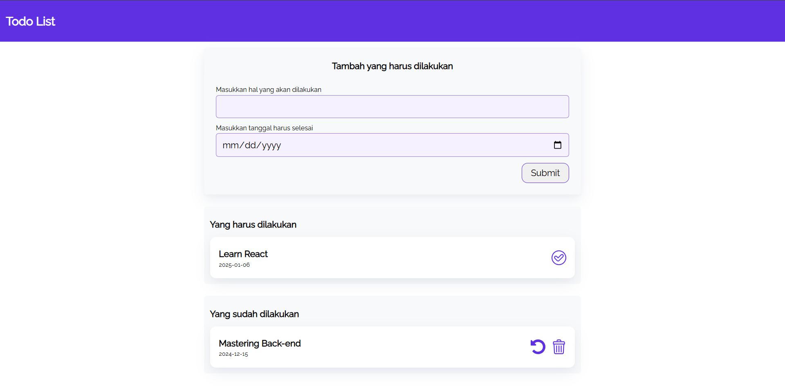

# Simple Todo App

Simple Todo App is a web application designed to help users manage their tasks efficiently. 

## Features
- **Task Management**: Add and delete tasks easily.
- **Categorization**: Organize tasks by categories.
- **Progress Tracking**: Mark tasks as complete and monitor your progress.

## Preview


## Getting Started
Follow these instructions to set up the project locally.

### Prerequisites
- A modern web browser (e.g., Chrome, Firefox, Edge)
- Visual Studio Code with the Live Server extension

### Installation and Display
1. Clone the repository:
   ```bash
   git clone https://github.com/bmmasaputra/simple-todo-app.git
   cd simple-todo-app
   ```

2. Open the project folder in Visual Studio Code:
   ```bash
   code .
   ```

3. Right-click on the `index.html` file in the file explorer and select "Open with Live Server."

4. The application will open automatically in your default web browser, or you can access it at:
   ```
   http://127.0.0.1:5500
   ```

5. Enjoy using the Simple Todo App directly in your browser environment.

## Contributing
We welcome contributions from the community! Please see our [CONTRIBUTING.md](CONTRIBUTING.md) for more details.

## License
This project is licensed under the MIT License. See the [LICENSE](LICENSE) file for details.

## Contact
For any inquiries, please contact us at [bimagung2203@gmail.com](mailto:bimagung2203@gmail.com).

---

_"Stay organized, one task at a time."_
